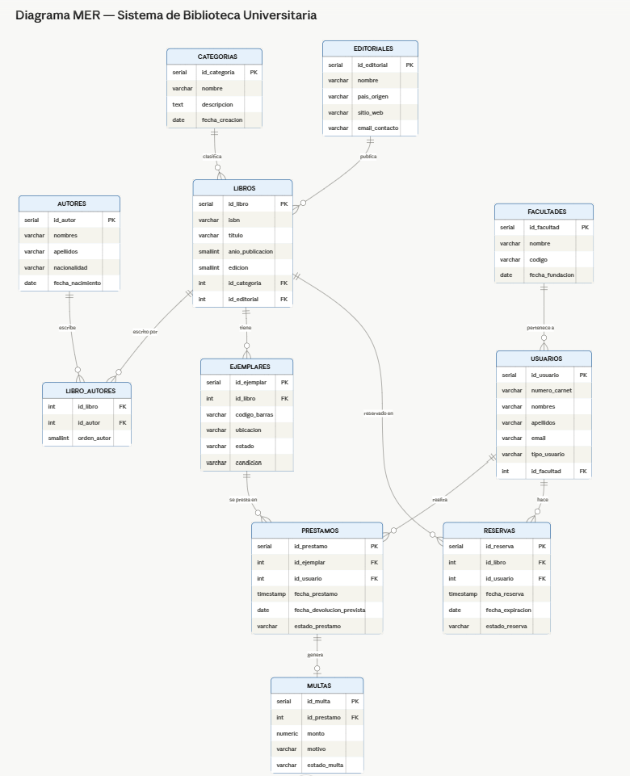

# 📚 Sistema de Gestión de Biblioteca Universitaria

**Base de Datos en PostgreSQL — Diseño, Normalización e Implementación**

---

## 🎯 Caso de Uso

Sistema de gestión para una **biblioteca universitaria** que administra:
- Catálogo de libros con autores, editoriales y categorías
- Control de ejemplares físicos y su disponibilidad
- Registro de usuarios (estudiantes, docentes, investigadores)
- Préstamos, devoluciones y renovaciones
- Sistema de reservas de libros
- Gestión de multas por retrasos o daños

---

## 🗄️ Modelo Entidad-Relación



### Entidades principales

| Entidad         | Descripción                              | PK            |
|-----------------|------------------------------------------|---------------|
| `categorias`    | Clasificación temática de libros         | id_categoria  |
| `editoriales`   | Datos de casas editoriales               | id_editorial  |
| `autores`       | Datos de autores de libros               | id_autor      |
| `libros`        | Registro bibliográfico del catálogo      | id_libro      |
| `libro_autores` | Relación N:M libros–autores              | (id_libro, id_autor) |
| `ejemplares`    | Copia física de un libro                 | id_ejemplar   |
| `facultades`    | Facultades o carreras universitarias     | id_facultad   |
| `usuarios`      | Miembros registrados de la biblioteca    | id_usuario    |
| `prestamos`     | Registro de préstamos de ejemplares      | id_prestamo   |
| `multas`        | Sanciones económicas por incumplimiento  | id_multa      |
| `reservas`      | Solicitud anticipada de un libro         | id_reserva    |

### Cardinalidades

```
categorias  ──< libros >── editoriales
libros      ──< libro_autores >── autores   (N:M)
libros      ──< ejemplares
ejemplares  ──< prestamos >── usuarios
prestamos   ──|| multas          (1:1 opcional)
libros      ──< reservas >── usuarios
facultades  ──< usuarios
```

---

## 🔢 Normalización

### Primera Forma Normal (1FN)
- Todos los atributos contienen valores **atómicos** (no compuestos).
- Se eliminaron grupos repetitivos: los autores se separaron en tabla propia con tabla de unión `libro_autores`.
- Cada tabla tiene una **llave primaria** definida.
- No existen columnas como `autor1, autor2, autor3` — eso violaría 1FN.

### Segunda Forma Normal (2FN)
- Todas las tablas con PK simple ya cumplen 2FN automáticamente.
- La tabla `libro_autores` tiene PK compuesta `(id_libro, id_autor)` y el único atributo no clave es `orden_autor`, que depende de **ambos** campos de la PK — cumple 2FN.
- No hay dependencias parciales en ninguna tabla.

### Tercera Forma Normal (3FN)
- No existen **dependencias transitivas**: 
  - `libros` no almacena `nombre_editorial` (depende de `id_editorial`), sino solo la FK.
  - `libros` no almacena `nombre_categoria` (depende de `id_categoria`), sino solo la FK.
  - `prestamos` no almacena `nombre_usuario` ni `titulo_libro` — usa FKs.
  - `multas` es una entidad separada de `prestamos` para evitar que `monto` dependa transitivamente de `id_usuario`.

### Evidencia 3FN — Descomposición aplicada

| Tabla original (sin normalizar)                     | Problema detectado                    | Solución aplicada           |
|-----------------------------------------------------|---------------------------------------|-----------------------------|
| `libros` con campo `nombre_editorial`               | Dependencia transitiva: nombre→ciudad | Tabla `editoriales`         |
| `libros` con `autor1, autor2, autor3`               | Grupo repetitivo (viola 1FN)          | Tabla `autores` + `libro_autores` |
| `prestamos` con campo `nombre_usuario`              | Redundancia / anomalía de actualización | FK a `usuarios`            |
| `prestamos` con campo `monto_multa`                 | Dependencia de atributo no clave      | Tabla `multas` separada     |
| `usuarios` con campo `nombre_facultad`              | Dependencia transitiva                | Tabla `facultades`          |

---

## 🛠️ Instrucciones de Instalación

### Requisitos previos
- PostgreSQL 13 o superior
- pgAdmin 4 (opcional, para interfaz gráfica)


```

### Verificación de datos
```sql
-- Contar registros por tabla
SELECT 'categorias'  AS tabla, COUNT(*) FROM categorias
UNION ALL SELECT 'editoriales', COUNT(*) FROM editoriales
UNION ALL SELECT 'autores',     COUNT(*) FROM autores
UNION ALL SELECT 'libros',      COUNT(*) FROM libros
UNION ALL SELECT 'ejemplares',  COUNT(*) FROM ejemplares
UNION ALL SELECT 'usuarios',    COUNT(*) FROM usuarios
UNION ALL SELECT 'prestamos',   COUNT(*) FROM prestamos
UNION ALL SELECT 'multas',      COUNT(*) FROM multas
UNION ALL SELECT 'reservas',    COUNT(*) FROM reservas;
```

---

## 🔍 Consultas de Ejemplo

```sql
-- 1. Catálogo completo con autores y disponibilidad
SELECT * FROM v_catalogo_libros;

-- 2. Préstamos activos con estado de vencimiento
SELECT * FROM v_prestamos_activos;

-- 3. Usuarios con deudas pendientes
SELECT * FROM v_usuarios_multas_pendientes;

-- 4. Libros más prestados (Top 5)
SELECT l.titulo, COUNT(p.id_prestamo) AS total_prestamos
FROM prestamos p
JOIN ejemplares ej ON p.id_ejemplar = ej.id_ejemplar
JOIN libros l ON ej.id_libro = l.id_libro
GROUP BY l.titulo
ORDER BY total_prestamos DESC
LIMIT 5;

-- 5. Ejemplares disponibles de un libro por ISBN
SELECT ej.codigo_barras, ej.ubicacion, ej.condicion
FROM ejemplares ej
JOIN libros l ON ej.id_libro = l.id_libro
WHERE l.isbn = '978-0-07-352332-3'
  AND ej.estado = 'disponible';
```

---

## 📊 Estadísticas del Dataset

| Tabla          | Registros |
|----------------|-----------|
| categorias     | 10        |
| editoriales    | 10        |
| autores        | 15        |
| libros         | 15        |
| libro_autores  | 16        |
| ejemplares     | 20        |
| facultades     | 5         |
| usuarios       | 12        |
| prestamos      | 12        |
| multas         | 3         |
| reservas       | 10        |

---

## 🧰 Herramientas Utilizadas

- **Motor de BD**: PostgreSQL 15
- **Interfaz**: pgAdmin 4
- **Modelado**: Draw.io / Lucidchart
- **Editor**: Visual Studio Code
- **Control de versiones**: Git + GitHub

---

## 📜 Licencia

Proyecto académico — MILTON CONTRERAS.
